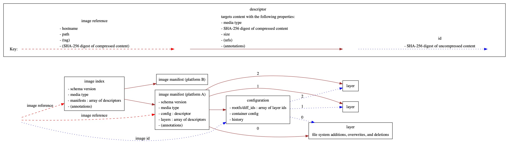

# go-containerregistry

## Introduction

This is a golang library for working with container registries.
It's largely based on the [Python library of the same name](https://github.com/google/containerregistry).

The following diagram shows the main types that this library handles.

## Tools

This repo hosts some tools built on top of the library.

### `crane`

[`crane`](cmd/crane/doc/crane.md) is a tool for interacting with remote images
and registries.

### `gcrane`

[`gcrane`](cmd/gcrane/README.md) is a GCR-specific variant of `crane` that has
richer output for the `ls` subcommand and some basic garbage collection support.

### `k8schain`

[`k8schain`](pkg/authn/k8schain/README.md) implements the authentication
semantics use by kubelets in a way that is easily consumable by this library.

`k8schain` is not a standalone tool, but it's linked here for visibility.

### Emeritus: [`ko`](https://github.com/google/ko)

This tool was originally developed in this repo but has since been moved to its
own repo.
