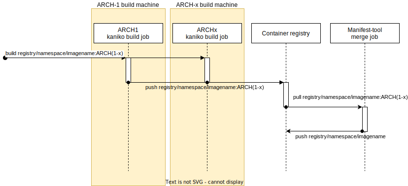

# kaniko - Build Images In Kubernetes

## 🚨NOTE: kaniko is not an officially supported Google product🚨

[](https://github.com/GoogleContainerTools/kaniko/actions/workflows/unit-tests.yaml)
[](https://github.com/GoogleContainerTools/kaniko/actions/workflows/integration-tests.yaml)
[](https://github.com/GoogleContainerTools/kaniko/actions/workflows/images.yaml)
[](https://goreportcard.com/report/github.com/GoogleContainerTools/kaniko)


kaniko is a tool to build container images from a Dockerfile, inside a container
or Kubernetes cluster.

kaniko doesn't depend on a Docker daemon and executes each command within a
Dockerfile completely in userspace. This enables building container images in
environments that can't easily or securely run a Docker daemon, such as a
standard Kubernetes cluster.

kaniko is meant to be run as an image: `gcr.io/kaniko-project/executor`. We do
**not** recommend running the kaniko executor binary in another image, as it
might not work as you expect - see [Known Issues](#known-issues).

We'd love to hear from you! Join us on
[#kaniko Kubernetes Slack](https://kubernetes.slack.com/messages/CQDCHGX7Y/)

:mega: **Please fill out our
[quick 5-question survey](https://forms.gle/HhZGEM33x4FUz9Qa6)** so that we can
learn how satisfied you are with kaniko, and what improvements we should make.
Thank you! :dancers:

_If you are interested in contributing to kaniko, see
[DEVELOPMENT.md](DEVELOPMENT.md) and [CONTRIBUTING.md](CONTRIBUTING.md)._

<!-- START doctoc generated TOC please keep comment here to allow auto update -->
<!-- DON'T EDIT THIS SECTION, INSTEAD RE-RUN doctoc TO UPDATE -->

**Table of Contents** _generated with
[DocToc](https://github.com/thlorenz/doctoc)_

- [kaniko - Build Images In Kubernetes](#kaniko---build-images-in-kubernetes)
  - [🚨NOTE: kaniko is not an officially supported Google product🚨](#note-kaniko-is-not-an-officially-supported-google-product)
  - [Community](#community)
  - [How does kaniko work?](#how-does-kaniko-work)
  - [Known Issues](#known-issues)
  - [Demo](#demo)
  - [Tutorial](#tutorial)
  - [Using kaniko](#using-kaniko)
    - [kaniko Build Contexts](#kaniko-build-contexts)
    - [Using Azure Blob Storage](#using-azure-blob-storage)
    - [Using Private Git Repository](#using-private-git-repository)
    - [Using Standard Input](#using-standard-input)
    - [Running kaniko](#running-kaniko)
      - [Running kaniko in a Kubernetes cluster](#running-kaniko-in-a-kubernetes-cluster)
        - [Kubernetes secret](#kubernetes-secret)
      - [Running kaniko in gVisor](#running-kaniko-in-gvisor)
      - [Running kaniko in Google Cloud Build](#running-kaniko-in-google-cloud-build)
      - [Running kaniko in Docker](#running-kaniko-in-docker)
    - [Caching](#caching)
      - [Caching Layers](#caching-layers)
      - [Caching Base Images](#caching-base-images)
    - [Pushing to Different Registries](#pushing-to-different-registries)
      - [Pushing to Docker Hub](#pushing-to-docker-hub)
      - [Pushing to Google GCR](#pushing-to-google-gcr)
      - [Pushing to GCR using Workload Identity](#pushing-to-gcr-using-workload-identity)
      - [Pushing to Amazon ECR](#pushing-to-amazon-ecr)
      - [Pushing to Azure Container Registry](#pushing-to-azure-container-registry)
      - [Pushing to JFrog Container Registry or to JFrog Artifactory](#pushing-to-jfrog-container-registry-or-to-jfrog-artifactory)
    - [Additional Flags](#additional-flags)
      - [Flag `--build-arg`](#flag---build-arg)
      - [Flag `--cache`](#flag---cache)
      - [Flag `--cache-dir`](#flag---cache-dir)
      - [Flag `--cache-repo`](#flag---cache-repo)
      - [Flag `--cache-copy-layers`](#flag---cache-copy-layers)
      - [Flag `--cache-run-layers`](#flag---cache-run-layers)
      - [Flag `--cache-ttl duration`](#flag---cache-ttl-duration)
      - [Flag `--cleanup`](#flag---cleanup)
      - [Flag `--compressed-caching`](#flag---compressed-caching)
      - [Flag `--context-sub-path`](#flag---context-sub-path)
      - [Flag `--custom-platform`](#flag---custom-platform)
      - [Flag `--digest-file`](#flag---digest-file)
      - [Flag `--dockerfile`](#flag---dockerfile)
      - [Flag `--force`](#flag---force)
      - [Flag `--git`](#flag---git)
      - [Flag `--image-name-with-digest-file`](#flag---image-name-with-digest-file)
      - [Flag `--image-name-tag-with-digest-file`](#flag---image-name-tag-with-digest-file)
      - [Flag `--insecure`](#flag---insecure)
      - [Flag `--insecure-pull`](#flag---insecure-pull)
      - [Flag `--insecure-registry`](#flag---insecure-registry)
      - [Flag `--label`](#flag---label)
      - [Flag `--log-format`](#flag---log-format)
      - [Flag `--log-timestamp`](#flag---log-timestamp)
      - [Flag `--no-push`](#flag---no-push)
      - [Flag `--no-push-cache`](#flag---no-push-cache)
      - [Flag `--oci-layout-path`](#flag---oci-layout-path)
      - [Flag `--push-retry`](#flag---push-retry)
      - [Flag `--registry-certificate`](#flag---registry-certificate)
      - [Flag `--registry-client-cert`](#flag---registry-client-cert)
      - [Flag `--registry-map`](#flag---registry-map)
      - [Flag `--registry-mirror`](#flag---registry-mirror)
      - [Flag `--skip-default-registry-fallback`](#flag---skip-default-registry-fallback)
      - [Flag `--reproducible`](#flag---reproducible)
      - [Flag `--single-snapshot`](#flag---single-snapshot)
      - [Flag `--skip-push-permission-check`](#flag---skip-push-permission-check)
      - [Flag `--skip-tls-verify`](#flag---skip-tls-verify)
      - [Flag `--skip-tls-verify-pull`](#flag---skip-tls-verify-pull)
      - [Flag `--skip-tls-verify-registry`](#flag---skip-tls-verify-registry)
      - [Flag `--skip-unused-stages`](#flag---skip-unused-stages)
      - [Flag `--snapshot-mode`](#flag---snapshot-mode)
      - [Flag `--tar-path`](#flag---tar-path)
      - [Flag `--target`](#flag---target)
      - [Flag `--use-new-run`](#flag---use-new-run)
      - [Flag `--verbosity`](#flag---verbosity)
      - [Flag `--ignore-var-run`](#flag---ignore-var-run)
      - [Flag `--ignore-path`](#flag---ignore-path)
      - [Flag `--image-fs-extract-retry`](#flag---image-fs-extract-retry)
      - [Flag `--image-download-retry`](#flag---image-download-retry)
    - [Debug Image](#debug-image)
  - [Security](#security)
    - [Verifying Signed Kaniko Images](#verifying-signed-kaniko-images)
  - [Kaniko Builds - Profiling](#kaniko-builds---profiling)
  - [Creating Multi-arch Container Manifests Using Kaniko and Manifest-tool](#creating-multi-arch-container-manifests-using-kaniko-and-manifest-tool)
    - [General Workflow](#general-workflow)
    - [Limitations and Pitfalls](#limitations-and-pitfalls)
    - [Example CI Pipeline (GitLab)](#example-ci-pipeline-gitlab)
      - [Building the Separate Container Images](#building-the-separate-container-images)
      - [Merging the Container Manifests](#merging-the-container-manifests)
      - [On the Note of Adding Versioned Tags](#on-the-note-of-adding-versioned-tags)
  - [Comparison with Other Tools](#comparison-with-other-tools)
  - [Community](#community-1)
  - [Limitations](#limitations)
    - [mtime and snapshotting](#mtime-and-snapshotting)
  - [References](#references)

<!-- END doctoc generated TOC please keep comment here to allow auto update -->

## Community

We'd love to hear from you! Join
[#kaniko on Kubernetes Slack](https://kubernetes.slack.com/messages/CQDCHGX7Y/)

## How does kaniko work?

The kaniko executor image is responsible for building an image from a Dockerfile
and pushing it to a registry. Within the executor image, we extract the
filesystem of the base image (the FROM image in the Dockerfile). We then execute
the commands in the Dockerfile, snapshotting the filesystem in userspace after
each one. After each command, we append a layer of changed files to the base
image (if there are any) and update image metadata.

## Known Issues

- kaniko does not support building Windows containers.
- Running kaniko in any Docker image other than the official kaniko image is not
  supported due to implementation details.
  - This includes copying the kaniko executables from the official image into
    another image (e.g. a Jenkins CI agent).
  - In particular, it cannot use chroot or bind-mount because its container must
    not require privilege, so it unpacks directly into its own container root
    and may overwrite anything already there.
- kaniko does not support the v1 Registry API
  ([Registry v1 API Deprecation](https://www.docker.com/blog/registry-v1-api-deprecation/))

## Demo


## Tutorial

For a detailed example of kaniko with local storage, please refer to a
[getting started tutorial](./docs/tutorial.md).

Please see [References](#References) for more docs & video tutorials

## Using kaniko

To use kaniko to build and push an image for you, you will need:

1. A [build context](#kaniko-build-contexts), aka something to build
2. A [running instance of kaniko](#running-kaniko)

### kaniko Build Contexts

kaniko's build context is very similar to the build context you would send your
Docker daemon for an image build; it represents a directory containing a
Dockerfile which kaniko will use to build your image. For example, a `COPY`
command in your Dockerfile should refer to a file in the build context.

You will need to store your build context in a place that kaniko can access.
Right now, kaniko supports these storage solutions:

- GCS Bucket
- S3 Bucket
- Azure Blob Storage
- Local Directory
- Local Tar
- Standard Input
- Git Repository

_Note about Local Directory: this option refers to a directory within the kaniko
container. If you wish to use this option, you will need to mount in your build
context into the container as a directory._

_Note about Local Tar: this option refers to a tar gz file within the kaniko
container. If you wish to use this option, you will need to mount in your build
context into the container as a file._

_Note about Standard Input: the only Standard Input allowed by kaniko is in
`.tar.gz` format._

If using a GCS or S3 bucket, you will first need to create a compressed tar of
your build context and upload it to your bucket. Once running, kaniko will then
download and unpack the compressed tar of the build context before starting the
image build.

To create a compressed tar, you can run:

```shell
tar -C <path to build context> -zcvf context.tar.gz .
```

Then, copy over the compressed tar into your bucket. For example, we can copy
over the compressed tar to a GCS bucket with gsutil:

```shell
gsutil cp context.tar.gz gs://<bucket name>
```

When running kaniko, use the `--context` flag with the appropriate prefix to
specify the location of your build context:

| Source             | Prefix                                                                | Example                                                                       |
| ------------------ | --------------------------------------------------------------------- | ----------------------------------------------------------------------------- |
| Local Directory    | dir://[path to a directory in the kaniko container]                   | `dir:///workspace`                                                            |
| Local Tar Gz       | tar://[path to a .tar.gz in the kaniko container]                     | `tar:///path/to/context.tar.gz`                                               |
| Standard Input     | tar://[stdin]                                                         | `tar://stdin`                                                                 |
| GCS Bucket         | gs://[bucket name]/[path to .tar.gz]                                  | `gs://kaniko-bucket/path/to/context.tar.gz`                                   |
| S3 Bucket          | s3://[bucket name]/[path to .tar.gz]                                  | `s3://kaniko-bucket/path/to/context.tar.gz`                                   |
| Azure Blob Storage | https://[account].[azureblobhostsuffix]/[container]/[path to .tar.gz] | `https://myaccount.blob.core.windows.net/container/path/to/context.tar.gz`    |
| Git Repository     | git://[repository url][#reference][#commit-id]                        | `git://github.com/acme/myproject.git#refs/heads/mybranch#<desired-commit-id>` |

If you don't specify a prefix, kaniko will assume a local directory. For
example, to use a GCS bucket called `kaniko-bucket`, you would pass in
`--context=gs://kaniko-bucket/path/to/context.tar.gz`.

### Using Azure Blob Storage

If you are using Azure Blob Storage for context file, you will need to pass
[Azure Storage Account Access Key](https://docs.microsoft.com/en-us/azure/storage/common/storage-configure-connection-string?toc=%2fazure%2fstorage%2fblobs%2ftoc.json)
as an environment variable named `AZURE_STORAGE_ACCESS_KEY` through Kubernetes
Secrets

### Using Private Git Repository

You can use `Personal Access Tokens` for Build Contexts from Private
Repositories from
[GitHub](https://blog.github.com/2012-09-21-easier-builds-and-deployments-using-git-over-https-and-oauth/).

You can either pass this in as part of the git URL (e.g.,
`git://TOKEN@github.com/acme/myproject.git#refs/heads/mybranch`) or using the
environment variable `GIT_TOKEN`.

You can also pass `GIT_USERNAME` and `GIT_PASSWORD` (password being the token)
if you want to be explicit about the username.

### Using Standard Input

If running kaniko and using Standard Input build context, you will need to add
the docker or kubernetes `-i, --interactive` flag. Once running, kaniko will
then get the data from `STDIN` and create the build context as a compressed tar.
It will then unpack the compressed tar of the build context before starting the
image build. If no data is piped during the interactive run, you will need to
send the EOF signal by yourself by pressing `Ctrl+D`.

Complete example of how to interactively run kaniko with `.tar.gz` Standard
Input data, using docker:

```shell
echo -e 'FROM alpine \nRUN echo "created from standard input"' > Dockerfile | tar -cf - Dockerfile | gzip -9 | docker run \
  --interactive -v $(pwd):/workspace gcr.io/kaniko-project/executor:latest \
  --context tar://stdin \
  --destination=<gcr.io/$project/$image:$tag>
```

Complete example of how to interactively run kaniko with `.tar.gz` Standard
Input data, using Kubernetes command line with a temporary container and
completely dockerless:

```shell
echo -e 'FROM alpine \nRUN echo "created from standard input"' > Dockerfile | tar -cf - Dockerfile | gzip -9 | kubectl run kaniko \
--rm --stdin=true \
--image=gcr.io/kaniko-project/executor:latest --restart=Never \
--overrides='{
  "apiVersion": "v1",
  "spec": {
    "containers": [
      {
        "name": "kaniko",
        "image": "gcr.io/kaniko-project/executor:latest",
        "stdin": true,
        "stdinOnce": true,
        "args": [
          "--dockerfile=Dockerfile",
          "--context=tar://stdin",
          "--destination=gcr.io/my-repo/my-image"
        ],
        "volumeMounts": [
          {
            "name": "cabundle",
            "mountPath": "/kaniko/ssl/certs/"
          },
          {
            "name": "docker-config",
            "mountPath": "/kaniko/.docker/"
          }
        ]
      }
    ],
    "volumes": [
      {
        "name": "cabundle",
        "configMap": {
          "name": "cabundle"
        }
      },
      {
        "name": "docker-config",
        "configMap": {
          "name": "docker-config"
        }
      }
    ]
  }
}'
```

### Running kaniko

There are several different ways to deploy and run kaniko:

- [In a Kubernetes cluster](#running-kaniko-in-a-kubernetes-cluster)
- [In gVisor](#running-kaniko-in-gvisor)
- [In Google Cloud Build](#running-kaniko-in-google-cloud-build)
- [In Docker](#running-kaniko-in-docker)

#### Running kaniko in a Kubernetes cluster

Requirements:

- Standard Kubernetes cluster (e.g. using
  [GKE](https://cloud.google.com/kubernetes-engine/))
- [Kubernetes Secret](#kubernetes-secret)
- A [build context](#kaniko-build-contexts)

##### Kubernetes secret

To run kaniko in a Kubernetes cluster, you will need a standard running
Kubernetes cluster and a Kubernetes secret, which contains the auth required to
push the final image.

To create a secret to authenticate to Google Cloud Registry, follow these steps:

1. Create a service account in the Google Cloud Console project you want to push
   the final image to with `Storage Admin` permissions.
2. Download a JSON key for this service account
3. Rename the key to `kaniko-secret.json`
4. To create the secret, run:

```shell
kubectl create secret generic kaniko-secret --from-file=<path to kaniko-secret.json>
```

_Note: If using a GCS bucket in the same GCP project as a build context, this
service account should now also have permissions to read from that bucket._

The Kubernetes Pod spec should look similar to this, with the args parameters
filled in:

```yaml
apiVersion: v1
kind: Pod
metadata:
  name: kaniko
spec:
  containers:
    - name: kaniko
      image: gcr.io/kaniko-project/executor:latest
      args:
        - "--dockerfile=<path to Dockerfile within the build context>"
        - "--context=gs://<GCS bucket>/<path to .tar.gz>"
        - "--destination=<gcr.io/$PROJECT/$IMAGE:$TAG>"
      volumeMounts:
        - name: kaniko-secret
          mountPath: /secret
      env:
        - name: GOOGLE_APPLICATION_CREDENTIALS
          value: /secret/kaniko-secret.json
  restartPolicy: Never
  volumes:
    - name: kaniko-secret
      secret:
        secretName: kaniko-secret
```

This example pulls the build context from a GCS bucket. To use a local directory
build context, you could consider using configMaps to mount in small build
contexts.

#### Running kaniko in gVisor

Running kaniko in [gVisor](https://github.com/google/gvisor) provides an
additional security boundary. You will need to add the `--force` flag to run
kaniko in gVisor, since currently there isn't a way to determine whether or not
a container is running in gVisor.

```shell
docker run --runtime=runsc -v $(pwd):/workspace -v ~/.config:/root/.config \
gcr.io/kaniko-project/executor:latest \
--dockerfile=<path to Dockerfile> --context=/workspace \
--destination=gcr.io/my-repo/my-image --force
```

We pass in `--runtime=runsc` to use gVisor. This example mounts the current
directory to `/workspace` for the build context and the `~/.config` directory
for GCR credentials.

#### Running kaniko in Google Cloud Build

Requirements:

- A [build context](#kaniko-build-contexts)

To run kaniko in GCB, add it to your build config as a build step:

```yaml
steps:
  - name: gcr.io/kaniko-project/executor:latest
    args:
      [
        "--dockerfile=<path to Dockerfile within the build context>",
        "--context=dir://<path to build context>",
        "--destination=<gcr.io/$PROJECT/$IMAGE:$TAG>",
      ]
```

kaniko will build and push the final image in this build step.

#### Running kaniko in Docker

Requirements:

- [Docker](https://docs.docker.com/install/)

We can run the kaniko executor image locally in a Docker daemon to build and
push an image from a Dockerfile.

For example, when using gcloud and GCR you could run kaniko as follows:

```shell
docker run \
    -v "$HOME"/.config/gcloud:/root/.config/gcloud \
    -v /path/to/context:/workspace \
    gcr.io/kaniko-project/executor:latest \
    --dockerfile /workspace/Dockerfile \
    --destination "gcr.io/$PROJECT_ID/$IMAGE_NAME:$TAG" \
    --context dir:///workspace/
```

There is also a utility script [`run_in_docker.sh`](./run_in_docker.sh) that can
be used as follows:

```shell
./run_in_docker.sh <path to Dockerfile> <path to build context> <destination of final image>
```

_NOTE: `run_in_docker.sh` expects a path to a Dockerfile relative to the
absolute path of the build context._

An example run, specifying the Dockerfile in the container directory
`/workspace`, the build context in the local directory
`/home/user/kaniko-project`, and a Google Container Registry as a remote image
destination:

```shell
./run_in_docker.sh /workspace/Dockerfile /home/user/kaniko-project gcr.io/$PROJECT_ID/$TAG
```

### Caching

#### Caching Layers

kaniko can cache layers created by `RUN`(configured by flag
`--cache-run-layers`) and `COPY` (configured by flag `--cache-copy-layers`)
commands in a remote repository. Before executing a command, kaniko checks the
cache for the layer. If it exists, kaniko will pull and extract the cached layer
instead of executing the command. If not, kaniko will execute the command and
then push the newly created layer to the cache.

Note that kaniko cannot read layers from the cache after a cache miss: once a
layer has not been found in the cache, all subsequent layers are built locally
without consulting the cache.

Users can opt into caching by setting the `--cache=true` flag. A remote
repository for storing cached layers can be provided via the `--cache-repo`
flag. If this flag isn't provided, a cached repo will be inferred from the
`--destination` provided.

#### Caching Base Images

kaniko can cache images in a local directory that can be volume mounted into the
kaniko pod. To do so, the cache must first be populated, as it is read-only. We
provide a kaniko cache warming image at `gcr.io/kaniko-project/warmer`:

```shell
docker run -v $(pwd):/workspace gcr.io/kaniko-project/warmer:latest --cache-dir=/workspace/cache --image=<image to cache> --image=<another image to cache>
docker run -v $(pwd):/workspace gcr.io/kaniko-project/warmer:latest --cache-dir=/workspace/cache --dockerfile=<path to dockerfile>
docker run -v $(pwd):/workspace gcr.io/kaniko-project/warmer:latest --cache-dir=/workspace/cache --dockerfile=<path to dockerfile> --build-arg version=1.19
```

`--image` can be specified for any number of desired images. `--dockerfile` can
be specified for the path of dockerfile for cache.These command will combined to
cache those images by digest in a local directory named `cache`. Once the cache
is populated, caching is opted into with the same `--cache=true` flag as above.
The location of the local cache is provided via the `--cache-dir` flag,
defaulting to `/cache` as with the cache warmer. See the `examples` directory
for how to use with kubernetes clusters and persistent cache volumes.

### Pushing to Different Registries

kaniko uses Docker credential helpers to push images to a registry.

kaniko comes with support for GCR, Docker `config.json` and Amazon ECR, but
configuring another credential helper should allow pushing to a different
registry.

#### Pushing to Docker Hub

Get your docker registry user and password encoded in base64

    echo -n USER:PASSWORD | base64

Create a `config.json` file with your Docker registry url and the previous
generated base64 string

**Note:** Please use v1 endpoint. See #1209 for more details

```json
{
  "auths": {
    "https://index.docker.io/v1/": {
      "auth": "xxxxxxxxxxxxxxx"
    }
  }
}
```

Run kaniko with the `config.json` inside `/kaniko/.docker/config.json`

```shell
docker run -ti --rm -v `pwd`:/workspace -v `pwd`/config.json:/kaniko/.docker/config.json:ro gcr.io/kaniko-project/executor:latest --dockerfile=Dockerfile --destination=yourimagename
```

#### Pushing to Google GCR

To create a credentials to authenticate to Google Cloud Registry, follow these
steps:

1. Create a
   [service account](https://console.cloud.google.com/iam-admin/serviceaccounts)
   or in the Google Cloud Console project you want to push the final image to
   with `Storage Admin` permissions.
2. Download a JSON key for this service account
3. (optional) Rename the key to `kaniko-secret.json`, if you don't rename, you
   have to change the name used the command(in the volume part)
4. Run the container adding the path in GOOGLE_APPLICATION_CREDENTIALS env var

```shell
docker run -ti --rm -e GOOGLE_APPLICATION_CREDENTIALS=/kaniko/config.json \
-v `pwd`:/workspace -v `pwd`/kaniko-secret.json:/kaniko/config.json:ro gcr.io/kaniko-project/executor:latest \
--dockerfile=Dockerfile --destination=yourimagename
```

#### Pushing to GCR using Workload Identity

If you have enabled Workload Identity on your GKE cluster then you can use the
workload identity to push built images to GCR without adding a
`GOOGLE_APPLICATION_CREDENTIALS` in your kaniko pod specification.

Learn more on how to
[enable](https://cloud.google.com/kubernetes-engine/docs/how-to/workload-identity#enable_on_cluster)
and
[migrate existing apps](https://cloud.google.com/kubernetes-engine/docs/how-to/workload-identity#migrate_applications_to)
to workload identity.

To authenticate using workload identity you need to run the kaniko pod using the
Kubernetes Service Account (KSA) bound to Google Service Account (GSA) which has
`Storage.Admin` permissions to push images to Google Container registry.

Please follow the detailed steps
[here](https://cloud.google.com/kubernetes-engine/docs/how-to/workload-identity#authenticating_to)
to create a Kubernetes Service Account, Google Service Account and create an IAM
policy binding between the two to allow the Kubernetes Service account to act as
the Google service account.

To grant the Google Service account the right permission to push to GCR, run the
following GCR command

```
gcloud projects add-iam-policy-binding $PROJECT \
  --member=serviceAccount:[gsa-name]@${PROJECT}.iam.gserviceaccount.com \
  --role=roles/storage.objectAdmin
```

Please ensure, kaniko pod is running in the namespace and with a Kubernetes
Service Account.

#### Pushing to Amazon ECR

The Amazon ECR
[credential helper](https://github.com/awslabs/amazon-ecr-credential-helper) is
built into the kaniko executor image.

1. Configure credentials

   1. You can use instance roles when pushing to ECR from a EC2 instance or from
      EKS, by
      [configuring the instance role permissions](https://docs.aws.amazon.com/AmazonECR/latest/userguide/ECR_on_EKS.html)
      (the AWS managed policy
      `EC2InstanceProfileForImageBuilderECRContainerBuilds` provides broad
      permissions to upload ECR images and may be used as configuration
      baseline). Additionally, set `AWS_SDK_LOAD_CONFIG=true` as environment
      variable within the kaniko pod. If running on an EC2 instance with an
      instance profile, you may also need to set
      `AWS_EC2_METADATA_DISABLED=true` for kaniko to pick up the correct
      credentials.

   2. Or you can create a Kubernetes secret for your `~/.aws/credentials` file
      so that credentials can be accessed within the cluster. To create the
      secret, run:
      `shell kubectl create secret generic aws-secret --from-file=<path to .aws/credentials> `

The Kubernetes Pod spec should look similar to this, with the args parameters
filled in. Note that `aws-secret` volume mount and volume are only needed when
using AWS credentials from a secret, not when using instance roles.

```yaml
apiVersion: v1
kind: Pod
metadata:
  name: kaniko
spec:
  containers:
    - name: kaniko
      image: gcr.io/kaniko-project/executor:latest
      args:
        - "--dockerfile=<path to Dockerfile within the build context>"
        - "--context=s3://<bucket name>/<path to .tar.gz>"
        - "--destination=<aws_account_id.dkr.ecr.region.amazonaws.com/my-repository:my-tag>"
      volumeMounts:
        # when not using instance role
        - name: aws-secret
          mountPath: /root/.aws/
  restartPolicy: Never
  volumes:
    # when not using instance role
    - name: aws-secret
      secret:
        secretName: aws-secret
```

#### Pushing to Azure Container Registry

An ACR
[credential helper](https://github.com/chrismellard/docker-credential-acr-env)
is built into the kaniko executor image, which can be used to authenticate with
well-known Azure environmental information.

To configure credentials, you will need to do the following:

1. Update the `credStore` section of `config.json`:

```json
{ "credsStore": "acr" }
```

A downside of this approach is that ACR authentication will be used for all
registries, which will fail if you also pull from DockerHub, GCR, etc. Thus, it
is better to configure the credential tool only for your ACR registries by using
`credHelpers` instead of `credsStore`:

```json
{ "credHelpers": { "mycr.azurecr.io": "acr-env" } }
```

You can mount in the new config as a configMap:

```shell
kubectl create configmap docker-config --from-file=<path to config.json>
```

2. Configure credentials

You can create a Kubernetes secret with environment variables required for
Service Principal authentication and expose them to the builder container.

```
AZURE_CLIENT_ID=<clientID>
AZURE_CLIENT_SECRET=<clientSecret>
AZURE_TENANT_ID=<tenantId>
```

If the above are not set then authentication falls back to managed service
identities and the MSI endpoint is attempted to be contacted which will work in
various Azure contexts such as App Service and Azure Kubernetes Service where
the MSI endpoint will authenticate the MSI context the service is running under.

The Kubernetes Pod spec should look similar to this, with the args parameters
filled in. Note that `azure-secret` secret is only needed when using Azure
Service Principal credentials, not when using a managed service identity.

```yaml
apiVersion: v1
kind: Pod
metadata:
  name: kaniko
spec:
  containers:
    - name: kaniko
      image: gcr.io/kaniko-project/executor:latest
      args:
        - "--dockerfile=<path to Dockerfile within the build context>"
        - "--context=s3://<bucket name>/<path to .tar.gz>"
        - "--destination=mycr.azurecr.io/my-repository:my-tag"
      envFrom:
        # when authenticating with service principal
        - secretRef:
            name: azure-secret
      volumeMounts:
        - name: docker-config
          mountPath: /kaniko/.docker/
  volumes:
    - name: docker-config
      configMap:
        name: docker-config
  restartPolicy: Never
```

#### Pushing to JFrog Container Registry or to JFrog Artifactory

Kaniko can be used with both
[JFrog Container Registry](https://www.jfrog.com/confluence/display/JFROG/JFrog+Container+Registry)
and JFrog Artifactory.

Get your JFrog Artifactory registry user and password encoded in base64

    echo -n USER:PASSWORD | base64

Create a `config.json` file with your Artifactory Docker local registry URL and
the previous generated base64 string

```json
{
  "auths": {
    "artprod.company.com": {
      "auth": "xxxxxxxxxxxxxxx"
    }
  }
}
```

For example, for Artifactory cloud users, the docker registry should be:
`<company>.<local-repository-name>.io`.

Run kaniko with the `config.json` inside `/kaniko/.docker/config.json`

    docker run -ti --rm -v `pwd`:/workspace -v `pwd`/config.json:/kaniko/.docker/config.json:ro gcr.io/kaniko-project/executor:latest --dockerfile=Dockerfile --destination=yourimagename

After the image is uploaded, using the JFrog CLI, you can
[collect](https://www.jfrog.com/confluence/display/CLI/CLI+for+JFrog+Artifactory#CLIforJFrogArtifactory-PushingDockerImagesUsingKaniko)
and
[publish](https://www.jfrog.com/confluence/display/CLI/CLI+for+JFrog+Artifactory#CLIforJFrogArtifactory-PublishingBuild-Info)
the build information to Artifactory and trigger
[build vulnerabilities scanning](https://www.jfrog.com/confluence/display/JFROG/Declarative+Pipeline+Syntax#DeclarativePipelineSyntax-ScanningBuildswithJFrogXray)
using JFrog Xray.

To collect and publish the image's build information using the Jenkins
Artifactory plugin, see instructions for
[scripted pipeline](https://www.jfrog.com/confluence/display/JFROG/Scripted+Pipeline+Syntax#ScriptedPipelineSyntax-UsingKaniko)
and
[declarative pipeline](https://www.jfrog.com/confluence/display/JFROG/Declarative+Pipeline+Syntax#DeclarativePipelineSyntax-UsingKaniko).

### Additional Flags

#### Flag `--build-arg`

This flag allows you to pass in ARG values at build time, similarly to Docker.
You can set it multiple times for multiple arguments.

Note that passing values that contain spaces is not natively supported - you
need to ensure that the IFS is set to null before your executor command. You can
set this by adding `export IFS=''` before your executor call. See the following
example

```bash
export IFS=''
/kaniko/executor --build-arg "MY_VAR='value with spaces'" ...
```

#### Flag `--cache`

Set this flag as `--cache=true` to opt into caching with kaniko.

#### Flag `--cache-dir`

Set this flag to specify a local directory cache for base images. Defaults to
`/cache`.

_This flag must be used in conjunction with the `--cache=true` flag._

#### Flag `--cache-repo`

Set this flag to specify a remote repository that will be used to store cached
layers.

If this flag is not provided, a cache repo will be inferred from the
`--destination` flag. If `--destination=gcr.io/kaniko-project/test`, then cached
layers will be stored in `gcr.io/kaniko-project/test/cache`.

_This flag must be used in conjunction with the `--cache=true` flag._

#### Flag `--cache-copy-layers`

Set this flag to cache copy layers.

#### Flag `--cache-run-layers`

Set this flag to cache run layers (default=true).

#### Flag `--cache-ttl duration`

Cache timeout in hours. Defaults to two weeks.

#### Flag `--cleanup`

Set this flag to clean the filesystem at the end of the build.

#### Flag `--compressed-caching`

Set this to false in order to prevent tar compression for cached layers. This
will increase the runtime of the build, but decrease the memory usage especially
for large builds. Try to use `--compressed-caching=false` if your build fails
with an out of memory error. Defaults to true.

#### Flag `--context-sub-path`

Set a sub path within the given `--context`.

Its particularly useful when your context is, for example, a git repository, and
you want to build one of its subfolders instead of the root folder.

#### Flag `--custom-platform`

Allows to build with another default platform than the host, similarly to docker
build --platform xxx the value has to be on the form
`--custom-platform=linux/arm`, with acceptable values listed here:
[GOOS/GOARCH](https://gist.github.com/asukakenji/f15ba7e588ac42795f421b48b8aede63).

It's also possible specifying CPU variants adding it as a third parameter (like
`--custom-platform=linux/arm/v5`). Currently CPU variants are only known to be
used for the ARM architecture as listed here:
[GOARM](https://go.dev/wiki/GoArm#supported-architectures)

_The resulting images cannot provide any metadata about CPU variant due to a
limitation of the OCI-image specification._

_This is not virtualization and cannot help to build an architecture not
natively supported by the build host. This is used to build i386 on an amd64
Host for example, or arm32 on an arm64 host._

#### Flag `--digest-file`

Set this flag to specify a file in the container. This file will receive the
digest of a built image. This can be used to automatically track the exact image
built by kaniko.

For example, setting the flag to `--digest-file=/dev/termination-log` will write
the digest to that file, which is picked up by Kubernetes automatically as the
`{{.state.terminated.message}}` of the container.

#### Flag `--dockerfile`

Path to the dockerfile to be built. (default "Dockerfile")

#### Flag `--force`

Force building outside of a container

#### Flag `--git`

Branch to clone if build context is a git repository (default
branch=,single-branch=false,recurse-submodules=false,insecure-skip-tls=false)

#### Flag `--image-name-with-digest-file`

Specify a file to save the image name w/ digest of the built image to.

#### Flag `--image-name-tag-with-digest-file`

Specify a file to save the image name w/ image tag and digest of the built image
to.

#### Flag `--insecure`

Set this flag if you want to push images to a plain HTTP registry. It is
supposed to be used for testing purposes only and should not be used in
production!

#### Flag `--insecure-pull`

Set this flag if you want to pull images from a plain HTTP registry. It is
supposed to be used for testing purposes only and should not be used in
production!

#### Flag `--insecure-registry`

You can set `--insecure-registry <registry-name>` to use plain HTTP requests
when accessing the specified registry. It is supposed to be used for testing
purposes only and should not be used in production! You can set it multiple
times for multiple registries.

#### Flag `--label`

Set this flag as `--label key=value` to set some metadata to the final image.
This is equivalent as using the `LABEL` within the Dockerfile.

#### Flag `--log-format`

Set this flag as `--log-format=<text|color|json>` to set the log format.
Defaults to `color`.

#### Flag `--log-timestamp`

Set this flag as `--log-timestamp=<true|false>` to add timestamps to
`<text|color>` log format. Defaults to `false`.

#### Flag `--no-push`

Set this flag if you only want to build the image, without pushing to a
registry. This can also be defined through `KANIKO_NO_PUSH` environment
variable.

NOTE: this will still push cache layers to the repo, to disable pushing cache layers use `--no-push-cache`

#### Flag `--no-push-cache`

Set this flag if you do not want to push cache layers to a
registry.  Can be used in addition to `--no-push` to push no layers to a registry.

#### Flag `--oci-layout-path`

Set this flag to specify a directory in the container where the OCI image layout
of a built image will be placed. This can be used to automatically track the
exact image built by kaniko.

For example, to surface the image digest built in a
[Tekton task](https://github.com/tektoncd/pipeline/blob/v0.6.0/docs/resources.md#surfacing-the-image-digest-built-in-a-task),
this flag should be set to match the image resource `outputImageDir`.

_Note: Depending on the built image, the media type of the image manifest might
be either `application/vnd.oci.image.manifest.v1+json` or
`application/vnd.docker.distribution.manifest.v2+json`._

#### Flag `--push-ignore-immutable-tag-errors`

Set this boolean flag to `true` if you want the Kaniko process to exit with
success when a push error related to tag immutability occurs.

This is useful for example if you have parallel builds pushing the same tag
and do not care which one actually succeeds.

Defaults to `false`.

#### Flag `--push-retry`

Set this flag to the number of retries that should happen for the push of an
image to a remote destination. Defaults to `0`.

#### Flag `--registry-certificate`

Set this flag to provide a certificate for TLS communication with a given
registry.

Expected format is `my.registry.url=/path/to/the/certificate.cert`

#### Flag `--registry-client-cert`

Set this flag to provide a certificate/key pair for mutual TLS (mTLS)
communication with a given
[registry that requires mTLS](https://docs.docker.com/engine/security/certificates/)
for authentication.

Expected format is
`my.registry.url=/path/to/client/cert.crt,/path/to/client/key.key`

#### Flag `--registry-map`

Set this flag if you want to remap registries references. Usefull for air gap
environement for example. You can use this flag more than once, if you want to
set multiple mirrors for a given registry. You can mention several remap in a
single flag too, separated by semi-colon. If an image is not found on the first
mirror, Kaniko will try the next mirror(s), and at the end fallback on the
original registry.

Registry maps can also be defined through `KANIKO_REGISTRY_MAP` environment
variable.

Expected format is
`original-registry=remapped-registry[;another-reg=another-remap[;...]]` for
example.

Note that you **can** specify a URL with scheme for this flag. Some valid options
are:

- `index.docker.io=mirror.gcr.io`
- `gcr.io=127.0.0.1`
- `quay.io=192.168.0.1:5000`
- `index.docker.io=docker-io.mirrors.corp.net;index.docker.io=mirror.gcr.io;gcr.io=127.0.0.1`
  will try `docker-io.mirrors.corp.net` then `mirror.gcr.io` for
  `index.docker.io` and `127.0.0.1` for `gcr.io`
- `docker.io=harbor.provate.io/theproject`

#### Flag `--registry-mirror`

Set this flag if you want to use a registry mirror instead of the default
`index.docker.io`. You can use this flag more than once, if you want to set
multiple mirrors. If an image is not found on the first mirror, Kaniko will try
the next mirror(s), and at the end fallback on the default registry.

Mirror can also be defined through `KANIKO_REGISTRY_MIRROR` environment
variable.

Expected format is `mirror.gcr.io` or `mirror.gcr.io/path` for example.

Note that you **can** specify a URL with scheme for this flag. Some valid options
are:

- `mirror.gcr.io`
- `127.0.0.1`
- `192.168.0.1:5000`
- `mycompany-docker-virtual.jfrog.io`
- `harbor.provate.io/theproject`

#### Flag `--skip-default-registry-fallback`

Set this flag if you want the build process to fail if none of the mirrors
listed in flag [registry-mirror](#flag---registry-mirror) can pull some image.
This should be used with mirrors that implements a whitelist or some image
restrictions.

If [registry-mirror](#flag---registry-mirror) is not set or is empty, this flag
is ignored.

#### Flag `--reproducible`

Set this flag to strip timestamps out of the built image and make it
reproducible.

#### Flag `--single-snapshot`

This flag takes a single snapshot of the filesystem at the end of the build, so
only one layer will be appended to the base image.

#### Flag `--skip-push-permission-check`

Set this flag to skip push permission check. This can be useful to delay Kanikos
first request for delayed network-policies.

#### Flag `--skip-tls-verify`

Set this flag to skip TLS certificate validation when pushing to a registry. It
is supposed to be used for testing purposes only and should not be used in
production!

#### Flag `--skip-tls-verify-pull`

Set this flag to skip TLS certificate validation when pulling from a registry.
It is supposed to be used for testing purposes only and should not be used in
production!

#### Flag `--skip-tls-verify-registry`

You can set `--skip-tls-verify-registry <registry-name>` to skip TLS certificate
validation when accessing the specified registry. It is supposed to be used for
testing purposes only and should not be used in production! You can set it
multiple times for multiple registries.

#### Flag `--skip-unused-stages`

This flag builds only used stages if defined to `true`. Otherwise it builds by
default all stages, even the unnecessary ones until it reaches the target stage
/ end of Dockerfile

#### Flag `--snapshot-mode`

You can set the `--snapshot-mode=<full (default), redo, time>` flag to set how
kaniko will snapshot the filesystem.

- If `--snapshot-mode=full` is set, the full file contents and metadata are
  considered when snapshotting. This is the least performant option, but also
  the most robust.

- If `--snapshot-mode=redo` is set, the file mtime, size, mode, owner uid and
  gid will be considered when snapshotting. This may be up to 50% faster than
  "full", particularly if your project has a large number files.

- If `--snapshot-mode=time` is set, only file mtime will be considered when
  snapshotting (see [limitations related to mtime](#mtime-and-snapshotting)).

#### Flag `--tar-path`

Set this flag as `--tar-path=<path>` to save the image as a tarball at path. You
need to set `--destination` as well (for example `--destination=image`). If you
want to save the image as tarball only you also need to set `--no-push`.

#### Flag `--target`

Set this flag to indicate which build stage is the target build stage.

#### Flag `--use-new-run`

Using this flag enables an experimental implementation of the Run command which
does not rely on snapshotting at all. In this approach, in order to compute
which files were changed, a marker file is created before executing the Run
command. Then the entire filesystem is walked (takes ~1-3 seconds for 700Kfiles)
to find all files whose ModTime is greater than the marker file. With this new
run command implementation, the total build time is reduced seeing performance
improvements in the range of ~75%. This new run mode trades off
accuracy/correctness in some cases (potential for missed files in a "snapshot")
for improved performance by avoiding the full filesystem snapshots.

#### Flag `--verbosity`

Set this flag as `--verbosity=<panic|fatal|error|warn|info|debug|trace>` to set
the logging level. Defaults to `info`.

#### Flag `--ignore-var-run`

Ignore /var/run when taking image snapshot. Set it to false to preserve
/var/run/\* in destination image. (Default true).

#### Flag `--ignore-path`

Set this flag as `--ignore-path=<path>` to ignore path when taking an image
snapshot. Set it multiple times for multiple ignore paths.

#### Flag `--image-fs-extract-retry`

Set this flag to the number of retries that should happen for the extracting an
image filesystem. Defaults to `0`.

#### Flag `--image-download-retry`

Set this flag to the number of retries that should happen when downloading the
remote image. Consecutive retries occur with exponential backoff and an initial
delay of 1 second. Defaults to 0`.

### Debug Image

The kaniko executor image is based on scratch and doesn't contain a shell. We
provide `gcr.io/kaniko-project/executor:debug`, a debug image which consists of
the kaniko executor image along with a busybox shell to enter.

You can launch the debug image with a shell entrypoint:

```shell
docker run -it --entrypoint=/busybox/sh gcr.io/kaniko-project/executor:debug
```

## Security

kaniko by itself **does not** make it safe to run untrusted builds inside your
cluster, or anywhere else.

kaniko relies on the security features of your container runtime to provide
build security.

The minimum permissions kaniko needs inside your container are governed by a few
things:

- The permissions required to unpack your base image into its container
- The permissions required to execute the RUN commands inside the container

If you have a minimal base image (SCRATCH or similar) that doesn't require
permissions to unpack, and your Dockerfile doesn't execute any commands as the
root user, you can run kaniko without root permissions. It should be noted that
Docker runs as root by default, so you still require (in a sense) privileges to
use kaniko.

You may be able to achieve the same default seccomp profile that Docker uses in
your Pod by setting
[seccomp](https://kubernetes.io/docs/concepts/policy/pod-security-policy/#seccomp)
profiles with annotations on a
[PodSecurityPolicy](https://cloud.google.com/kubernetes-engine/docs/how-to/pod-security-policies)
to create or update security policies on your cluster.

### Verifying Signed Kaniko Images

kaniko images are signed for versions >= 1.5.2 using
[cosign](https://github.com/sigstore/cosign)!

To verify a public image, install [cosign](https://github.com/sigstore/cosign)
and use the provided [public key](cosign.pub):

```
$ cat cosign.pub
-----BEGIN PUBLIC KEY-----
MFkwEwYHKoZIzj0CAQYIKoZIzj0DAQcDQgAE9aAfAcgAxIFMTstJUv8l/AMqnSKw
P+vLu3NnnBDHCfREQpV/AJuiZ1UtgGpFpHlJLCNPmFkzQTnfyN5idzNl6Q==
-----END PUBLIC KEY-----

$ cosign verify -key ./cosign.pub gcr.io/kaniko-project/executor:latest
```

## Kaniko Builds - Profiling

If your builds are taking long, we recently added support to analyze kaniko
function calls using [Slow Jam](https://github.com/google/slowjam) To start
profiling,

1. Add an environment variable `STACKLOG_PATH` to your
   [pod definition](https://github.com/GoogleContainerTools/kaniko/blob/master/examples/pod-build-profile.yaml#L15).
2. If you are using the kaniko `debug` image, you can copy the file in the
   `pre-stop` container lifecycle hook.

## Creating Multi-arch Container Manifests Using Kaniko and Manifest-tool

While Kaniko itself currently does not support creating multi-arch manifests
(contributions welcome), one can use tools such as
[manifest-tool](https://github.com/estesp/manifest-tool) to stitch multiple
separate builds together into a single container manifest.

### General Workflow

The general workflow for creating multi-arch manifests is as follows:

1. Build separate container images using Kaniko on build hosts matching your
   target architecture and tag them with the appropriate ARCH tag.
2. Push the separate images to your container registry.
3. Manifest-tool identifies the separate manifests in your container registry,
   according to a given template.
4. Manifest-tool pushes a combined manifest referencing the separate manifests.



### Limitations and Pitfalls

The following conditions must be met:

1. You need access to build-machines running the desired architectures (running
   Kaniko in an emulator, e.g. QEMU should also be possible but goes beyond the
   scope of this documentation). This is something to keep in mind when using
   SaaS build tools such as github.com or gitlab.com, of which at the time of
   writing neither supports any non-x86_64 SaaS runners
   ([GitHub](https://docs.github.com/en/actions/using-github-hosted-runners/about-github-hosted-runners/about-github-hosted-runners#supported-runners-and-hardware-resources),[GitLab](https://docs.gitlab.com/ee/ci/runners/saas/linux_saas_runner.html#machine-types-available-for-private-projects-x86-64)),
   so be prepared to bring your own machines
   ([GitHub](https://docs.github.com/en/actions/hosting-your-own-runners/managing-self-hosted-runners/about-self-hosted-runners),[GitLab](https://docs.gitlab.com/runner/register/).
2. Kaniko needs to be able to run on the desired architectures. At the time of
   writing, the official Kaniko container supports
   [linux/amd64, linux/arm64, linux/s390x and linux/ppc64le (not on \*-debug images)](https://github.com/GoogleContainerTools/kaniko/blob/main/.github/workflows/images.yaml).
3. The container registry of your choice must be OCIv1 or Docker v2.2
   compatible.

### Example CI Pipeline (GitLab)

It is up to you to find an automation tool that suits your needs best. We
recommend using a modern CI/CD system such as GitHub workflows or GitLab CI. As
we (the authors) happen to use GitLab CI, the following examples are tailored to
this specific platform but the underlying principles should apply anywhere else
and the examples are kept simple enough, so that you should be able to follow
along, even without any previous experiences with this specific platform. When
in doubt, visit the
[gitlab-ci.yml reference page](https://docs.gitlab.com/ee/ci/yaml/index.html)
for a comprehensive overview of the GitLab CI keywords.

#### Building the Separate Container Images

gitlab-ci.yml:

```yaml
# define a job for building the containers
build-container:
  stage: container-build
  # run parallel builds for the desired architectures
  parallel:
    matrix:
      - ARCH: amd64
      - ARCH: arm64
  tags:
    # run each build on a suitable, preconfigured runner (must match the target architecture)
    - runner-${ARCH}
  image:
    name: gcr.io/kaniko-project/executor:debug
    entrypoint: [""]
  script:
    # build the container image for the current arch using kaniko
    - >-
      /kaniko/executor --context "${CI_PROJECT_DIR}" --dockerfile
      "${CI_PROJECT_DIR}/Dockerfile" # push the image to the GitLab container
      registry, add the current arch as tag. --destination
      "${CI_REGISTRY_IMAGE}:${ARCH}"
```

#### Merging the Container Manifests

gitlab-ci.yml:

```yaml
# define a job for creating and pushing a merged manifest
merge-manifests:
  stage: container-build
  # all containers must be build before merging them
  # alternatively the job may be configured to run in a later stage
  needs:
    - job: container-build
      artifacts: false
  tags:
    # may run on any architecture supported by manifest-tool image
    - runner-xyz
  image:
    name: mplatform/manifest-tool:alpine
    entrypoint: [""]
  script:
    - >-
      manifest-tool # authorize against your container registry
      --username=${CI_REGISTRY_USER} --password=${CI_REGISTRY_PASSWORD} push
      from-args # define the architectures you want to merge --platforms
      linux/amd64,linux/arm64 # "ARCH" will be automatically replaced by
      manifest-tool # with the appropriate arch from the platform definitions
      --template ${CI_REGISTRY_IMAGE}:ARCH # The name of the final, combined
      image which will be pushed to your registry --target ${CI_REGISTRY_IMAGE}
```

#### On the Note of Adding Versioned Tags

For simplicity's sake we deliberately refrained from using versioned tagged
images (all builds will be tagged as "latest") in the previous examples, as we
feel like this adds to much platform and workflow specific code.

Nethertheless, for anyone interested in how we handle (dynamic) versioning in
GitLab, here is a short rundown:

- If you are only interested in building tagged releases, you can simply use the
  [GitLab predefined](https://docs.gitlab.com/ee/ci/variables/predefined_variables.html)
  `CI_COMMIT_TAG` variable when running a tag pipeline.
- When you (like us) want to additionally build container images outside of
  releases, things get a bit messier. In our case, we added a additional job
  which runs before the build and merge jobs (don't forget to extend the `needs`
  section of the build and merge jobs accordingly), which will set the tag to
  `latest` when running on the default branch, to the commit hash when run on
  other branches and to the release tag when run on a tag pipeline.

gitlab-ci.yml:

```yaml
container-get-tag:
  stage: pre-container-build-stage
  tags:
    - runner-xyz
  image: busybox
  script:
    # All other branches are tagged with the currently built commit SHA hash
    - |
      # If pipeline runs on the default branch: Set tag to "latest"
      if test "$CI_COMMIT_BRANCH" == "$CI_DEFAULT_BRANCH"; then
        tag="latest"
      # If pipeline is a tag pipeline, set tag to the git commit tag
      elif test -n "$CI_COMMIT_TAG"; then
        tag="$CI_COMMIT_TAG"
      # Else set the tag to the git commit sha
      else
        tag="$CI_COMMIT_SHA"
      fi
    - echo "tag=$tag" > build.env
  # parse tag to the build and merge jobs.
  # See: https://docs.gitlab.com/ee/ci/variables/#pass-an-environment-variable-to-another-job
  artifacts:
    reports:
      dotenv: build.env
```

## Comparison with Other Tools

Similar tools include:

- [BuildKit](https://github.com/moby/buildkit)
- [img](https://github.com/genuinetools/img)
- [orca-build](https://github.com/cyphar/orca-build)
- [umoci](https://github.com/openSUSE/umoci)
- [buildah](https://github.com/containers/buildah)
- [FTL](https://github.com/GoogleCloudPlatform/runtimes-common/tree/master/ftl)
- [Bazel rules_docker](https://github.com/bazelbuild/rules_docker)

All of these tools build container images with different approaches.

BuildKit (and `img`) can perform as a non-root user from within a container but
requires seccomp and AppArmor to be disabled to create nested containers.
`kaniko` does not actually create nested containers, so it does not require
seccomp and AppArmor to be disabled. BuildKit supports "cross-building"
multi-arch containers by leveraging QEMU.

`orca-build` depends on `runc` to build images from Dockerfiles, which can not
run inside a container (for similar reasons to `img` above). `kaniko` doesn't
use `runc` so it doesn't require the use of kernel namespacing techniques.
However, `orca-build` does not require Docker or any privileged daemon (so
builds can be done entirely without privilege).

`umoci` works without any privileges, and also has no restrictions on the root
filesystem being extracted (though it requires additional handling if your
filesystem is sufficiently complicated). However, it has no `Dockerfile`-like
build tooling (it's a slightly lower-level tool that can be used to build such
builders -- such as `orca-build`).

`Buildah` specializes in building OCI images. Buildah's commands replicate all
of the commands that are found in a Dockerfile. This allows building images with
and without Dockerfiles while not requiring any root privileges. Buildah’s
ultimate goal is to provide a lower-level coreutils interface to build images.
The flexibility of building images without Dockerfiles allows for the
integration of other scripting languages into the build process. Buildah follows
a simple fork-exec model and does not run as a daemon but it is based on a
comprehensive API in golang, which can be vendored into other tools.

`FTL` and `Bazel` aim to achieve the fastest possible creation of Docker images
for a subset of images. These can be thought of as a special-case "fast path"
that can be used in conjunction with the support for general Dockerfiles kaniko
provides.

## Community

[kaniko-users](https://groups.google.com/forum/#!forum/kaniko-users) Google
group

To Contribute to kaniko, see [DEVELOPMENT.md](DEVELOPMENT.md) and
[CONTRIBUTING.md](CONTRIBUTING.md).

## Limitations

### mtime and snapshotting

When taking a snapshot, kaniko's hashing algorithms include (or in the case of
[`--snapshot-mode=time`](#--snapshotmode), only use) a file's
[`mtime`](https://en.wikipedia.org/wiki/Inode#POSIX_inode_description) to
determine if the file has changed. Unfortunately, there is a delay between when
changes to a file are made and when the `mtime` is updated. This means:

- With the time-only snapshot mode (`--snapshot-mode=time`), kaniko may miss
  changes introduced by `RUN` commands entirely.
- With the default snapshot mode (`--snapshot-mode=full`), whether or not kaniko
  will add a layer in the case where a `RUN` command modifies a file **but the
  contents do not** change is theoretically non-deterministic. This _does not
  affect the contents_ which will still be correct, but it does affect the
  number of layers.

_Note that these issues are currently theoretical only. If you see this issue
occur, please
[open an issue](https://github.com/GoogleContainerTools/kaniko/issues)._

### Dockerfile commands `--chown` support
Kaniko currently supports `COPY --chown` and `ADD --chown` Dockerfile command. It does not support `RUN --chown`.

## References

- [Kaniko - Building Container Images In Kubernetes Without Docker](https://youtu.be/EgwVQN6GNJg).
